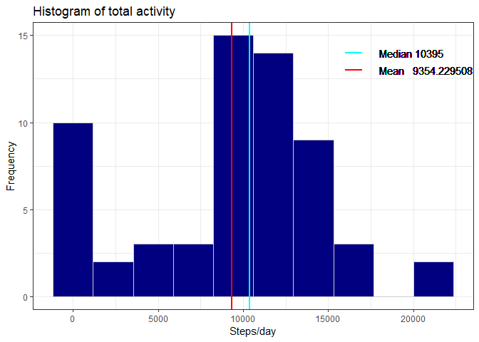
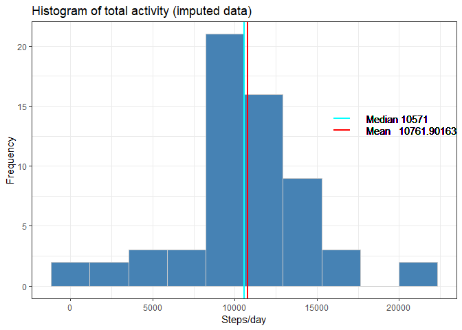

## Introduction
This report is written as a Peer Review Project for the Reproducible Research course, which is part of the Data Science Specialization program from [JHU](https://www.jhu.edu). It is an exercise to use of R Markdown with some embedded code as a way to publish reproducible research.

As usual, first we need some intialization code, in this case to load the libraries used: dplyr, for some table manipulations; hms, a convenient library to handle times without dates; and ggplot2 for charting.  


```r
# Required libraries
library(dplyr)
library(hms)
library(ggplot2)
```
  
  
## Loading and preprocessing the data

Data is assumed readily available at list as a zip file pulled from the repository and, very likely, already expanded to a csv, so there is no need to expand it every time. Reading is pretty straight forward.  


```r
sfile <- "activity.csv"
sZIP  <- "activity.ZIP"

if (!file.exists(sfile)) unzip(sZIP)

# Read csv file 
srcdata <- read.csv("activity.csv",stringsAsFactors = FALSE)
```

Once we have the data, we need a little tidying to make it easier to use:  

* Dates are read as strings and converted to dates.  
* Intervals are read as numbers, with hundreds representing hours and the remainder minutes, and are converted to hours (hms class). This yields a nice scale in the plots instead of meaningless numbers.  
* A new var is added identifying the day as weekday or weekend. The locale is previously set to English, so we check for Saturday and Sunday instead of sábado and domingo (which don't make sense to most in this class).  
  
  

```r
# Mutate base data to get workable vars: date and hms

Sys.setlocale(category = "LC_TIME",locale = "English") # weekday in English

srcdata <- mutate(srcdata,
                  date     = as.Date(date),
                  interval = hms(hours = interval%/%100, minutes = interval%%100),
                  day      = weekdays(date) %in% c("Saturday","Sunday"))

srcdata$day <- factor(srcdata$day,levels=c(TRUE,FALSE),labels = c("Weekend","Weekday"))
```
  
  
## What is mean total number of steps taken per day?

To calculate the mean number of steps taken per day, we need first to group all data per day, and then totalize removing any NAs in the dataset. Mean and median per day are then easily obtained.  


```r
# Group per day and get total steps, mean and median
pltdata <- srcdata %>% group_by(date) %>% summarize(steps=sum(steps, na.rm=TRUE))
pltdata <- as.data.frame(pltdata) # to avoid warning bug in dplyr
stpmean <- mean(pltdata$steps)
stpmed  <- median(pltdata$steps)
```

The subject walked a **mean of 9354.2295082 steps per day**. The chart below shows a histogram of the total steps taken per day, and the mean and median points are identified as vertical bars in the chart.


```r
# Plot histogram and overlay median and mean values
g1 <- ggplot(pltdata,aes(steps))+
      geom_histogram(bins = 10, fill = "navy", col = "grey80")+
      geom_vline(xintercept = stpmean, lwd=1, col = "red")+
      geom_text(aes(x=18000, y=13, label = paste0("Mean   ",stpmean)),adj=0)+
      geom_segment(aes(x=16000, xend=17000 ,y=13, yend=13), lwd=1, col ="red")+
      geom_vline(xintercept = stpmed, lwd=1, col = "cyan")+
      geom_text(aes(x=18000, y=14, label = paste0("Median ",stpmed)),adj=0)+
      geom_segment(aes(x=16000, xend=17000 ,y=14, yend=14), lwd=1, col ="cyan")+
      xlab("Steps/day")+ylab("Frequency")+ggtitle("Histogram of total activity")+
      theme_bw()

print(g1)
```

<!-- -->
  

## What is the average daily activity pattern?

To calculate average daily patterns we have to group data per interval and then obtain the mean, always removing NAs. The chart below shows a pattern with higher activity in the morning, and other lower peaks by mid day, afternoon, and early evening. We do not have enough information to asses the reason for these peaks, but they are congruent with daily commutes, lunch breaks, and fixed exercise hours.


```r
# Group by interval and get mean steps across all days
pltdata <- srcdata %>% group_by(interval) %>% summarize(steps=mean(steps, na.rm = TRUE))
pltdata <- as.data.frame(pltdata) # to avoid warning bug in dplyr
maxidx  <- which.max(pltdata$steps)
maxX    <- pltdata$interval[maxidx+5]             # Overlay X
maxY    <- pltdata$steps[maxidx]                  # Overlay y
maxlbl  <- paste0(pltdata$interval[maxidx]," - ", # Overlay txt
                  pltdata$interval[maxidx+1])

g2 <- ggplot(pltdata,aes(x=interval,y=steps))+
      geom_line(lwd=1,col="coral2")+
      geom_text(aes(x=maxX, y=maxY, label = paste0("Highest activity interval ",maxlbl)),adj=0)+
      xlab("Interval")+ylab("Steps")+ggtitle("Mean daily activity")+
      theme_bw()

print(g2)
```

<!-- -->

The highest activity interval corresponds to **08:35:00 - 08:40:00 with 206 steps** in the interval.
  
## Imputing missing values

The dataset contains a total of **2304 missing values**. We impute missing values with the mean of the interval in similar days, week-end or week day, for what we have developed our own impute function, since the default impute methods do not consider columns other than the affected (my knowledge of R universe is rather limited).


```r
# function to get mean steps of similar interval and weekday

myMean <- function(interval, day)
    round(mean(srcdata$steps[(srcdata$interval == interval) & 
                       (srcdata$day      == day)],na.rm = TRUE),0)

myImpute <- function(data){
    imputed <- apply(data,1,function (x)
        ifelse(is.na(x[["steps"]]),
               myMean(as.hms(x[["interval"]]),x[["day"]]),
               as.integer(x[["steps"]])))
    data$steps <- imputed
    return(data)
}


impdata <- myImpute(srcdata)
```

With the new imputed dataset we can repeat the histogram of total daily activity, and we see that mean and median have not changed significantly, the frequency of low activity days has dropped over 7 points, while the frequency of high activity days has increased over 5 points.


```r
# Group per day and get total steps, mean and median
pltdata <- impdata %>% group_by(date) %>% summarize(steps=sum(steps))
pltdata <- as.data.frame(pltdata) # to avoid warning bug in dplyr
stpmean <- mean(pltdata$steps)
stpmed  <- median(pltdata$steps)

# Plot histogram and overlay median and mean values
g3 <- ggplot(pltdata,aes(steps))+
      geom_histogram(bins = 10, fill = "steelblue", col = "grey80")+
      geom_vline(xintercept = stpmean, lwd=1, col = "red")+
      geom_text(aes(x=18000, y=13, label = paste0("Mean   ",stpmean)),adj=0)+
      geom_segment(aes(x=16000, xend=17000 ,y=13, yend=13), lwd=1, col ="red")+
      geom_vline(xintercept = stpmed, lwd=1, col = "cyan")+
      geom_text(aes(x=18000, y=14, label = paste0("Median ",stpmed)),adj=0)+
      geom_segment(aes(x=16000, xend=17000 ,y=14, yend=14), lwd=1, col ="cyan")+
      xlab("Steps/day")+ylab("Frequency")+ggtitle("Histogram of total activity (imputed data)")+
      theme_bw()

print(g3)
```

<!-- -->
  

## Are there differences in activity patterns between weekdays and weekends?

Plotting together the activty patterns for weekdays and weekends, we can see that the morning peak is lower on weekends, followed by higher activity all day long, what is congruent with a sedentary type of work (office or similar) that shows lower activity during working hours on weekdays, and higher physical activity on weekends.


```r
# Group by weekday and interval and get mean steps across all days
pltdata <- impdata %>% group_by(day,interval) %>% summarize(steps=mean(steps))
pltdata <- as.data.frame(pltdata) # to avoid warning bug in dplyr

g4 <- ggplot(pltdata,aes(x=interval,y=steps, col=day))+
      geom_line(lwd=1)+
      xlab("Interval")+ylab("Steps")+ggtitle("Mean daily activity")+
      facet_wrap(.~day, nrow = 2)+
      theme_bw()

print(g4)
```

<!-- -->
  

## Conclusion and Comments

This is neat (or knit)  

Default HTML output sucks, so I had to devote well over an hour to look for a solution, that I found in the form of the _theme_ value in the YAML section of the Rmd document header. This particular theme is __flatly__.  

Instructions said to execute knit2html() from the console, but this fails (something to do with the Markdown version of my Rmd file), and it suggest we excute render() instead, which seems to work.

Quisque vestibulum commodo libero, quis imperdiet sapien mattis ac. Mauris nec fringilla erat. Suspendisse eget condimentum dui. Morbi eget laoreet neque. Curabitur tristique in sem ultricies tempus. In hac habitasse platea dictumst. Vivamus nec diam sit amet felis consequat mattis eu sed arcu. Nullam ipsum risus, euismod nec ligula at, bibendum feugiat lacus. Sed augue erat, dictum non varius eget, pharetra sed ipsum. Orci varius natoque penatibus et magnis dis parturient montes, nascetur ridiculus mus. 
